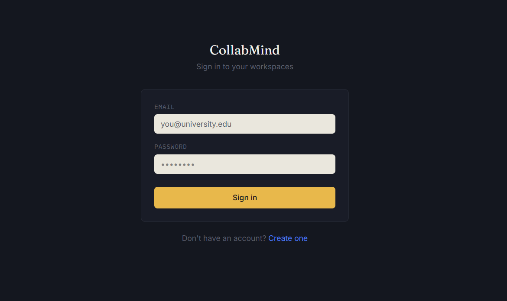
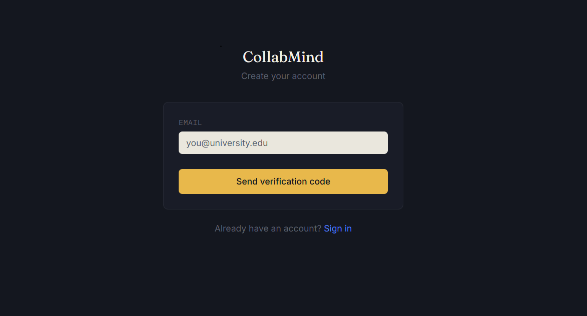
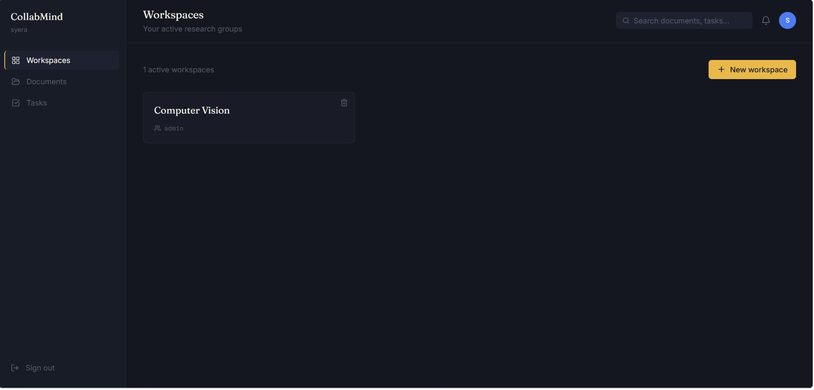
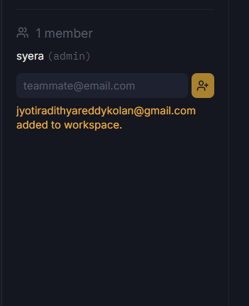
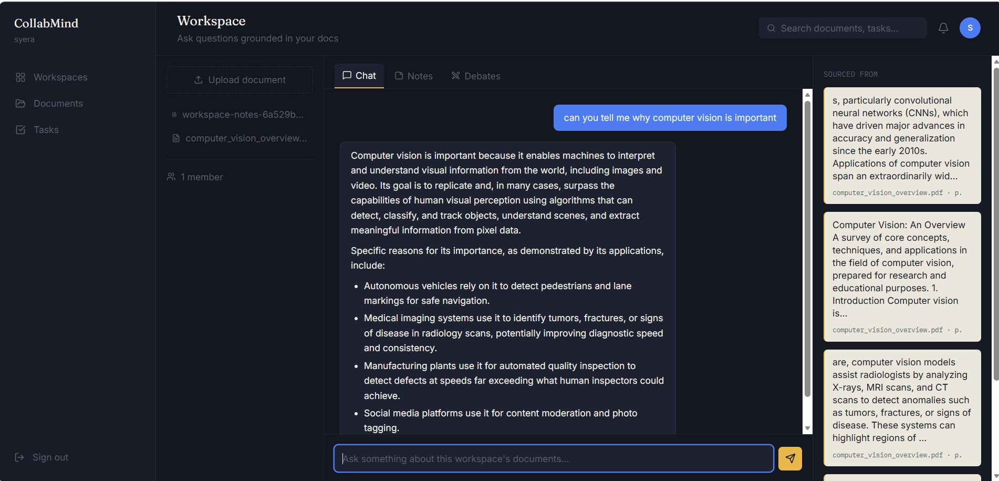
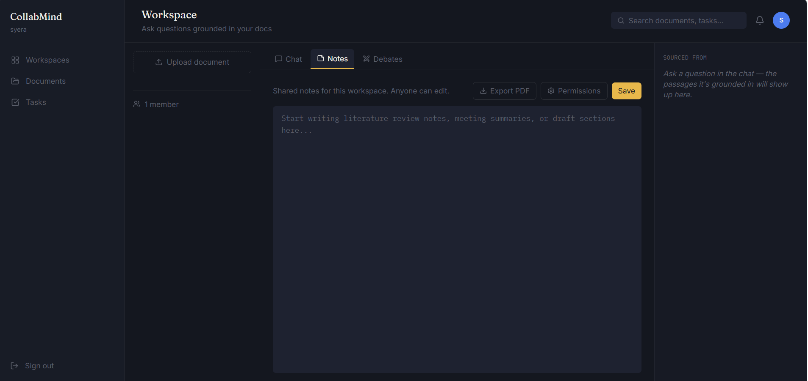
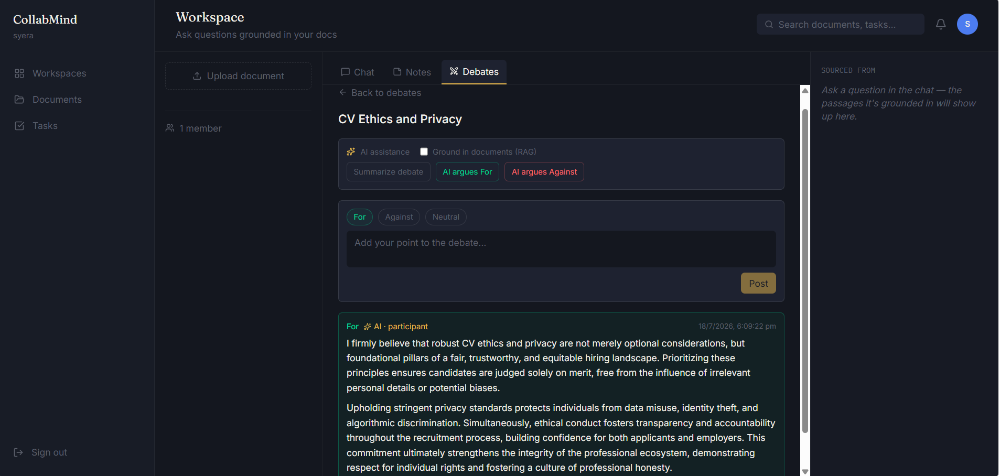

# CollabMind

**AI-powered research collaboration platform** — upload documents, chat with them using RAG, take shared notes, manage tasks, and run structured AI-assisted debates, all in one workspace.

🔗 **Live demo:** [collabmind-five.vercel.app](https://collabmind-five.vercel.app)

> Note: the backend runs on a free-tier host that spins down after inactivity — the first request after idle time may take 30–60 seconds to respond.

---

## Overview

CollabMind is a full-stack MERN application built for research teams to collaborate around shared documents. Members can upload PDFs, ask natural-language questions grounded in those documents (RAG), co-write notes, track tasks, and hold structured debates where an AI can summarize arguments, generate counter-points, or argue a position as its own participant.

---

## Screenshots

### Login


### Sign Up


### Workspace Dashboard


### Inviting Members


### AI-Grounded Document Chat


### Shared Notes


### AI-Assisted Debates


---

## Features

### Authentication & Workspaces
- Signup flow with email verification: enter email → receive a one-time 6-digit code → verify → set name and password
- Password requirements enforced on both frontend and backend (minimum 8 characters, at least 1 symbol)
- Login with email + password (no OTP required after the account is created)
- Create workspaces, invite teammates by email with an explicit accept/decline flow
- Role-based membership (admin / member)
- Admin-only workspace deletion, with full cascade cleanup of related documents, notes, tasks, debates, and memberships

### Document Intelligence (RAG)
- Upload PDF documents to a workspace
- Automatic text extraction, chunking, and embedding generation
- Ask questions grounded in uploaded documents — answers cite the specific source passages used
- Documents stored permanently in Cloudinary (not on local/ephemeral server disk)

### Shared Notes
- One collaborative notes document per workspace
- Owner-controlled edit permissions (all members / selected members / owner only)
- Export notes as a formatted PDF

### Task Management
- Create, track, and update tasks within a workspace

### AI-Assisted Debates
- Multiple structured debate topics per workspace
- For / Against / Neutral comments with upvoting
- AI capabilities (each with an optional "ground in documents" toggle):
  - Generate a counter-argument to any comment
  - Summarize the debate fairly, covering both sides
  - Have the AI argue a position as its own participant
  - Suggest debate topics based on workspace context

### Markdown Rendering
AI-generated responses in chat and debates render as properly formatted text (bold, lists, code) instead of raw markdown symbols.

---

## Tech Stack

**Frontend**
- React (Vite)
- React Router (with protected routes for authenticated pages)
- Tailwind CSS v4
- Axios
- react-markdown
- Lucide icons

**Backend**
- Node.js + Express
- Mongoose (MongoDB ODM)
- JWT authentication + bcrypt password hashing
- Nodemailer (Gmail SMTP) — OTP email delivery
- Multer (in-memory file handling)
- pdf-parse (PDF text extraction)
- pdfkit (PDF generation for notes export)

**AI**
- Google Gemini API
  - `gemini-embedding-001` — document embeddings
  - `gemini-2.5-flash` — chat answers, debate summaries, AI-generated arguments
- Custom-built RAG retrieval pipeline (cosine similarity search over stored embeddings)

**Database & Storage**
- MongoDB Atlas (cloud-hosted database)
- Cloudinary (permanent cloud storage for uploaded documents)

**Hosting**
- Backend: [Render](https://render.com)
- Frontend: [Vercel](https://vercel.com)
- Both connected to GitHub for automatic redeployment on every push

---

## Project Structure

```
collabmind/
├── irc-backend/          # Express API server
│   ├── config/            # Third-party service configuration (Cloudinary)
│   ├── middleware/         # Auth guard, file upload handling
│   ├── models/              # Mongoose schemas
│   ├── routes/               # API route handlers
│   ├── scripts/               # One-off maintenance scripts
│   ├── utils/                  # Embeddings, text processing, similarity scoring, email
│   └── index.js                 # App entry point
│
└── irc-frontend/          # React (Vite) client
    └── src/
        ├── api/            # Axios client
        ├── components/      # Reusable UI components, ProtectedRoute
        ├── context/           # Auth context/provider
        ├── Layouts/            # Page layout wrapper
        └── Pages/               # Route-level pages
```

---

## Running Locally

### Prerequisites
- Node.js
- A MongoDB Atlas connection string (or local MongoDB)
- A Google Gemini API key
- A Cloudinary account (cloud name, API key, API secret)
- A Gmail account with an App Password (for sending OTP emails)

### Backend setup

```bash
cd irc-backend
npm install
```

Create `irc-backend/.env`:

```
MONGO_URI=your_mongodb_connection_string
JWT_SECRET=your_random_secret_string
GEMINI_API_KEY=your_gemini_api_key
CLOUDINARY_CLOUD_NAME=your_cloud_name
CLOUDINARY_API_KEY=your_api_key
CLOUDINARY_API_SECRET=your_api_secret
GMAIL_USER=your_gmail_address
GMAIL_APP_PASSWORD=your_16_character_app_password
```

```bash
npm run dev
```

### Frontend setup

```bash
cd irc-frontend
npm install
```

Create `irc-frontend/.env`:

```
VITE_API_URL=http://localhost:5000/api
```

```bash
npm run dev
```

The app will be available at `http://localhost:5173`.

---

## Deployment Notes

- Backend and frontend are deployed as two separate services from the same GitHub monorepo, each pointed at its respective subfolder (`irc-backend` / `irc-frontend`) via the host's "Root Directory" setting.
- Environment variables are configured separately on each hosting platform's dashboard — they are **not** read from a committed `.env` file (which is git-ignored).
- CORS on the backend is restricted to the deployed frontend origin and `localhost` for local development.
- File imports are case-sensitive on the Linux-based hosting environment even though the local development OS may not be — this was a real issue encountered during deployment and is worth double-checking if a build succeeds locally but fails on the host.

---

## Known Limitations

- OTP emails are sent via a personal Gmail account (SMTP), since email delivery to arbitrary recipients requires either a verified sending domain (not yet purchased) or this kind of workaround
- Gemini API free tier is capped at a limited number of requests per day
- MongoDB Atlas free tier has a storage cap suitable for demo/portfolio use, not high-volume production traffic
- Backend free-tier hosting spins down after inactivity, causing a delayed first response
- No account deletion feature yet (workspace deletion exists; full account deletion does not)
- Deleting a document's database record does not currently delete the underlying file from Cloudinary storage

---

## Roadmap

- [ ] Delete my account
- [ ] Notes preview mode (rendered markdown while editing)
- [ ] Edit/delete for documents
- [ ] Verified sending domain for OTP emails (removes Gmail SMTP dependency)
- [ ] Google Sign-In
- [ ] Threaded (nested) debate replies

---

## License

This project was built for educational/portfolio purposes.
